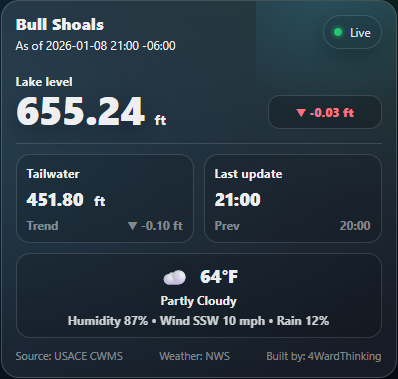

# Bull Shoals Widget

**Live at:** https://levels.fourwardcast.com/

[](https://levels.fourwardcast.com/)

## What it shows
- Bull Shoals **lake level** (headwater) with up/down trend
- **Tailwater** with up/down trend
- Local **weather** (NWS) with humidity, wind, and rain chance

## Data sources
- USACE CWMS Data API (CDA)
- National Weather Service API

## Run locally
```bash
dotnet run
```
Then open:
- http://localhost:5201/ (widget)
- http://localhost:5201/api/status (data)

## Embed on your website:
```
<iframe
  src="https://levels.fourwardcast.com/?embed=1"
  width="420"
  height="380"
  loading="lazy"
  scrolling="no"
  frameborder="0"
  title="Bull Shoals Lake Levels">
</iframe>
```
